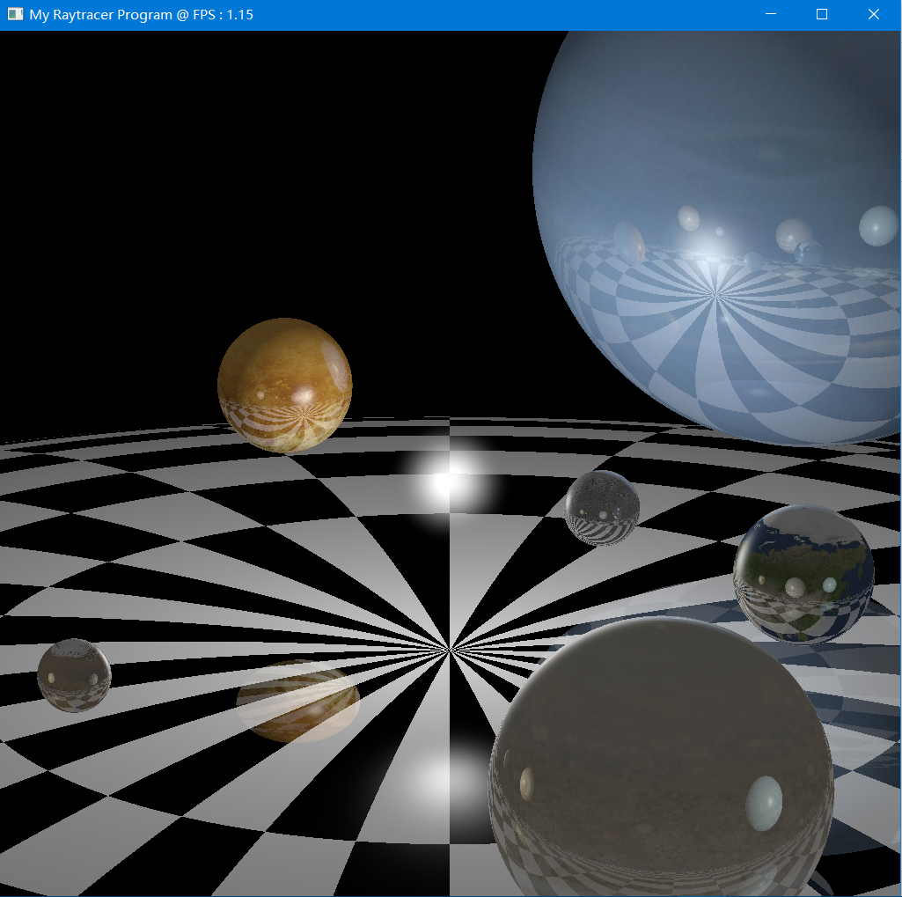

## CG Project: Raytracer

Main contributors: [stratoes](https://github.com/stratoes), [dzerzhinski01](https://github.com/dzerzhinski), [MengLcool](https://github.com/MengLcool) 

A Raytracer as CG course project, with Phong Lighting and 2-level ray reflection.

Implemented using OpenGL Compute Shader.

